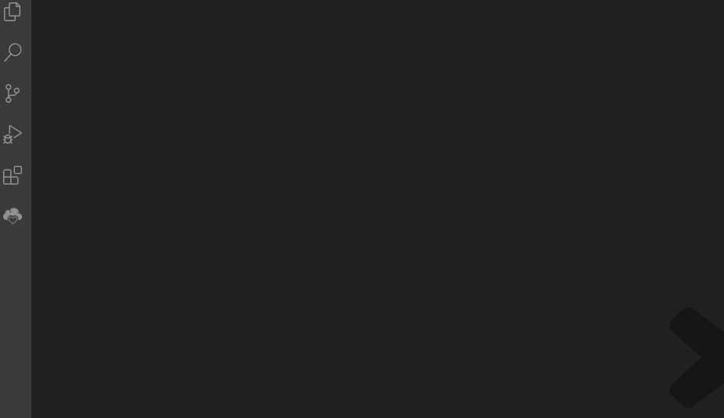
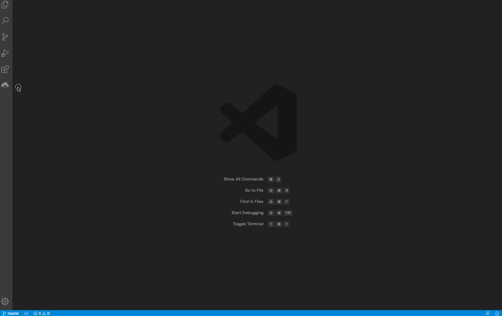
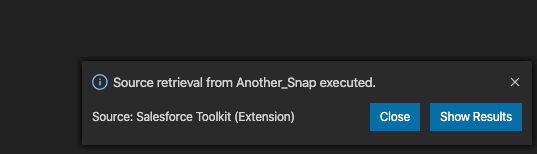
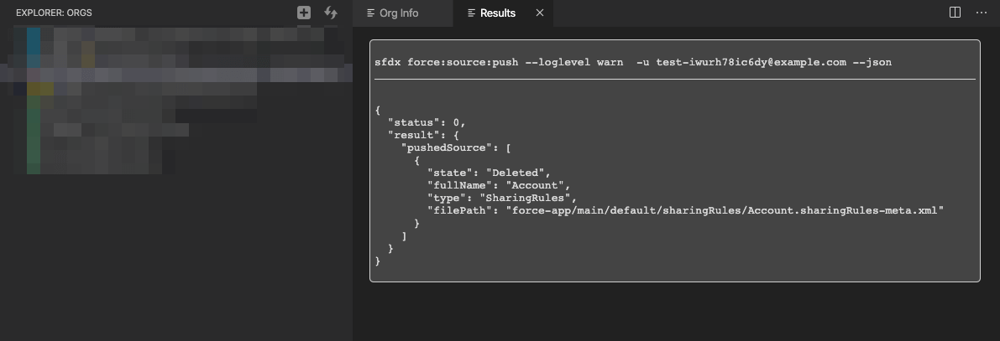

# i2max Salesforce Toolkit

This extension is designed to support developers with Salesforce DX projects. Provides quick visual access to scratch orgs, sandboxes, and other useful features.
The icon will appear if the workspace contains the Salesforce's DX project `sfdx-project.json` file.

**Note:** Requires [Salesforce CLI](https://developer.salesforce.com/tools/salesforcecli) installed.

# Main Features

### Orgs Explorer

Shows the Orgs (Dev Hubs, Sandboxes and Scratch Orgs) with different icon colors depending on the type.
On mouse hover, there are quick actions available (Open, Setup, Delete, Set as default)

Color code:

- Blue = Dev Hub
- Green = Sandbox
- Gray = Scratch Org
- Yellow = Default Scratch Org

---

### Org Info Panel

Clicking on an org from the Org Explorer, opens a practical all-in-one Info Panel for the org selected.

Info & Actions available:

- Quick view for Org Id, Release, API Version, Type and username
- Change Alias
- Show Access Token
- Show quick Link (Scratch orgs only). This link allows anyone to access to the org without login!
- Open org Homepage / Setup Page / Deployment Status Page
- Logout from org
- Run Unit Tests (RunLocalTests)
- Deploy source
- SOQL Query tool
- REST API Explorer

---

### Results Viewer Panel

After performing source push or pull operations, clicking on the "Show Results" button of the notification

You will access a page with the output of the DX command, in JSON.

---

**Enjoy!**

---

## Security Notes

- **Runs entirely locally.** All extension code executes inside VS Code on your machine. No extension server is involved.
- **Uses the local Salesforce CLI.** Authentication is handled by the `sf` CLI already installed on your system. The extension never asks for passwords or tokens.
- **Outbound calls stay in your org.** The only outbound HTTP calls made by this extension go to the Salesforce instance URL of the authenticated org. All other destinations are blocked.
- **Tokens are never logged.** OAuth access tokens retrieved from the CLI are used exclusively as in-memory `Authorization` header values and are never written to the Output panel, logs, files, or telemetry.
- **Shell injection is prevented.** All CLI invocations use `child_process.execFile` with argument arrays — a shell is never spawned.
- **No telemetry.** This extension does not collect or transmit usage data of any kind.

See [SECURITY.md](SECURITY.md) and [PRIVACY.md](PRIVACY.md) for full details.

This software is free of charge, opensource, and it's developed during my spare time. If you feel that you want to contribute, you can:

---

Icons made by [Smashicons](https://www.flaticon.com/authors/smashicons) from [www.flaticon.com](https://www.flaticon.com/)
